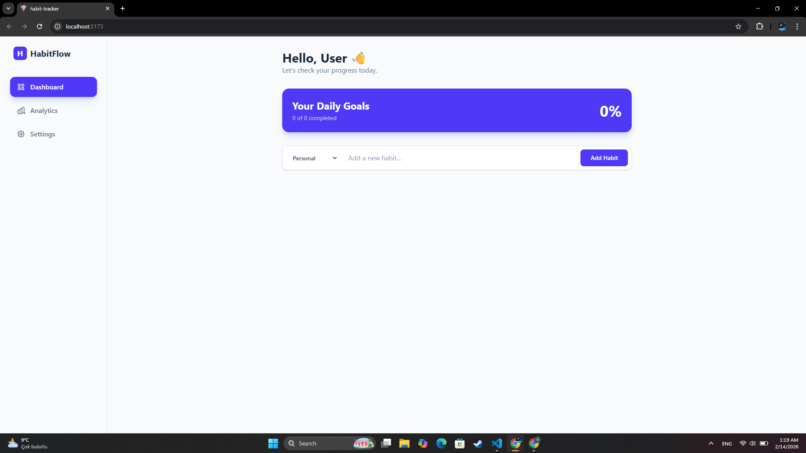
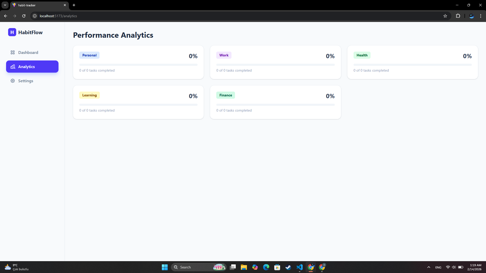
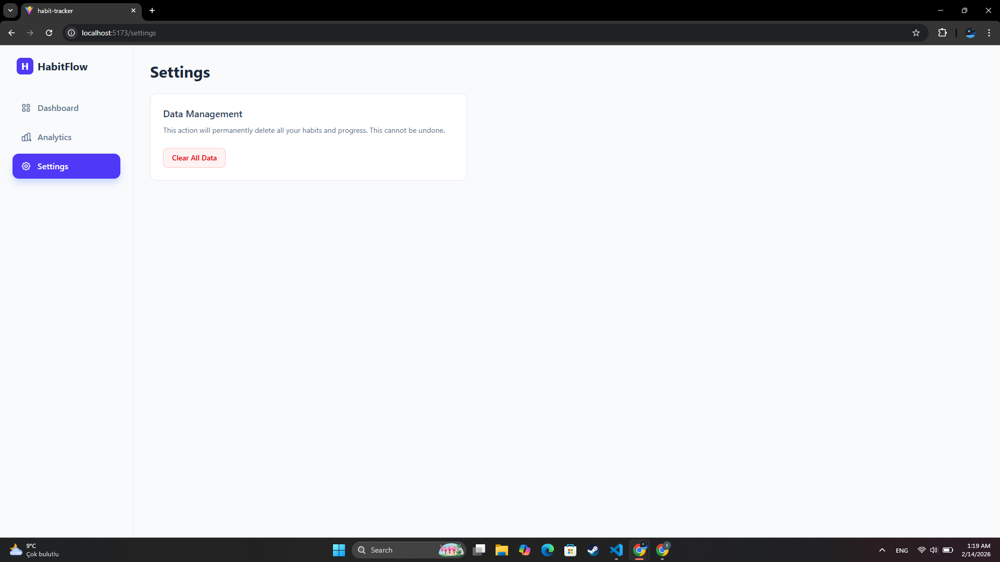

# Habit Tracker ✅

A simple habit tracker app. You can add habits, list them, update them, and delete them.

## 🔗 Live Demo

- Netlify: **https://698fa836cf3584272100a8c2--habit-tracker-site.netlify.app/**

## ✨ Features

- ✅ Add habit
- 📋 List habits
- ✏️ Update habit
- 🗑️ Delete habit

## 🖼️ Screenshots

> Images are loaded from the `screenshots/` folder.





## 🧰 Tech Stack

- Vite
- Tailwind CSS
- JavaScript

## 📁 Project Structure

```
habit_tracker/
  public/
  screenshots/
  src/
    Components/
    Pages/
    Interfaces/
```

## 🚀 Getting Started (Local)

```bash
npm install
npm run dev
```

## 🏗️ Build

```bash
npm run build
npm run preview
```

## 🌍 Deployment

This project is deployed on Netlify. Every time you push to GitHub, Netlify can automatically redeploy
